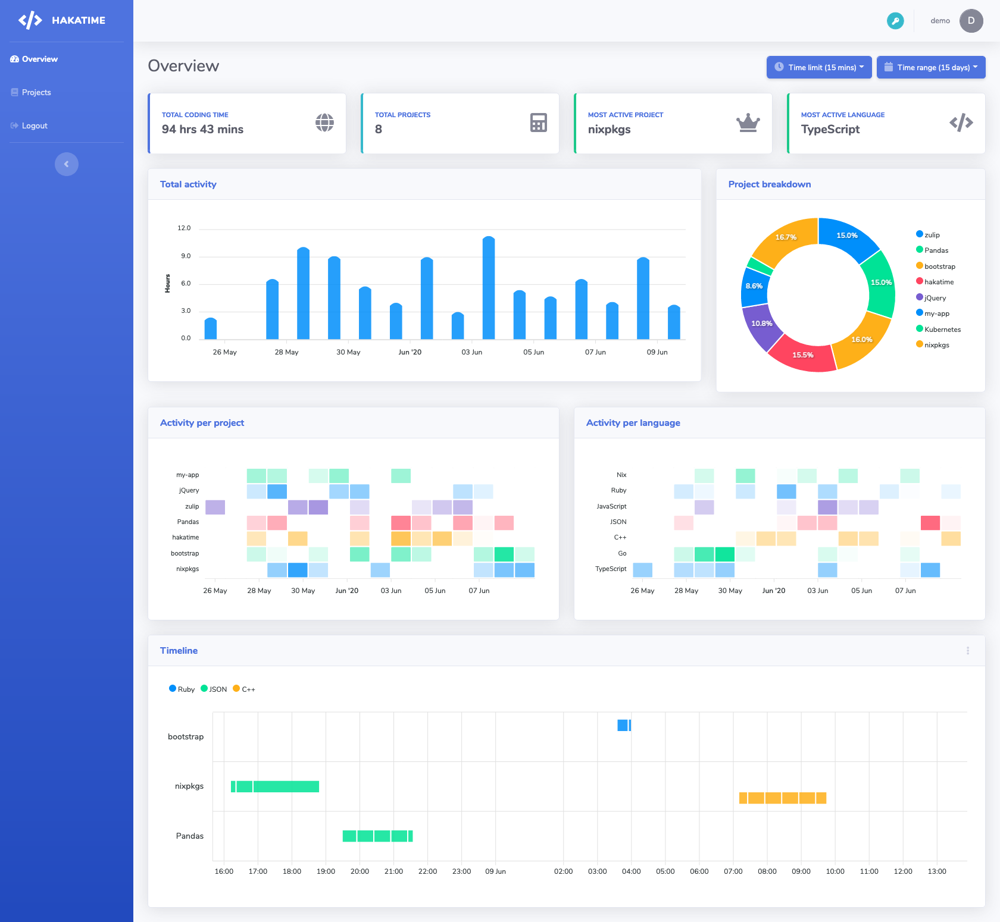
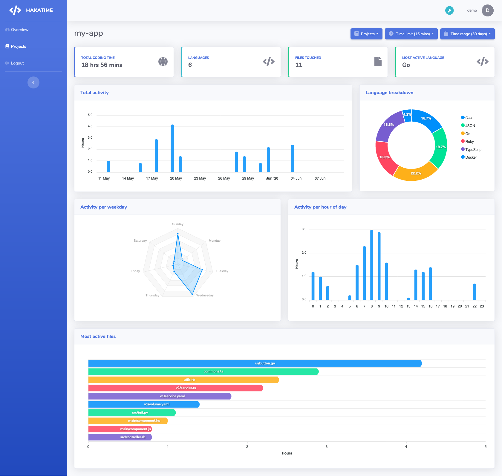
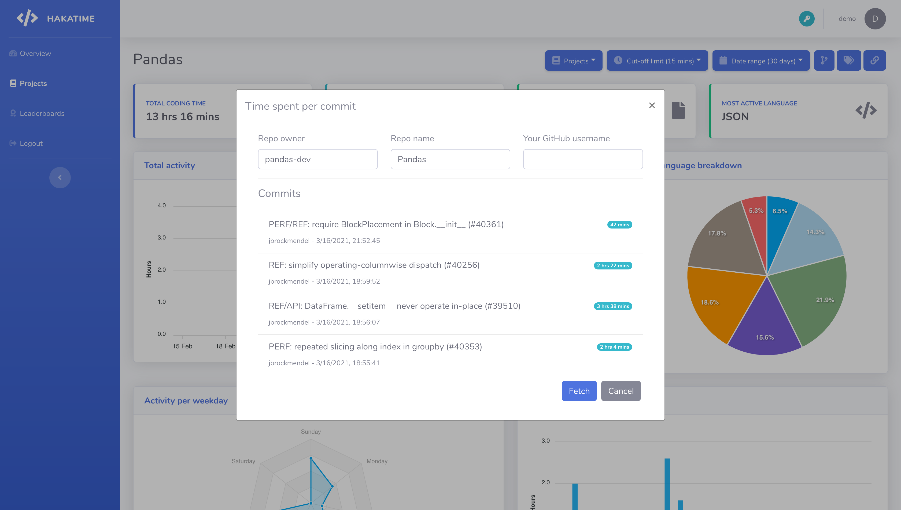

# hakatime

[](https://github.com/mujx/hakatime/releases)
[](https://nixos.org/)

Hakatime is a server implementation of [Wakatime](https://wakatime.com/). You can use it as a self-hosted alternative.

It comes together with a dashboard which provides a graphical representation of the collected data.

## Features

- Import Wakatime activity using an API token and a range of dates.
- See time spent on Github commits.
- Forward incoming heartbeats to another Wakatime compatible server (e.g `wakatime.com`)
- Group projects together with tags (e.g `#work`, `#personal`) and view their aggregated statistics.
- User registration & login through the UI.
- Leaderboards for all the users of the instance.
- Badge generation for a project that displays that total amount of hours spent for a configurable
  time period. [](https://hakatime.mtx-dev.xyz/badge/svg/4e8273d1-84bc-46f9-890b-14fdfb83cdcc?days=7)
- Global and per project charts
  - Breakdown by project or language.
  - Breakdown by day of week and hour of the day.
  - Timeline of activity for a configurable time-frame.
  - Total time spent per file.
- API token management & generation.

## Demo

There is an instance [here](https://hakatime.mtx-dev.xyz) that you can use to send data or browse
around.

Use `demo` as username and `demodemo` as password or create your own user to login. You can create
an API token and try sending your data.

## Client setup

After you've generated a new API token from Hakatime's UI, update your `~/.wakatime.cfg` file like below:

```ini
[settings]
api_key=<generated_token>

# e.g api_url=https://hakatime.mtx-dev.xyz/api/v1/users/current/heartbeats.bulk for the demo instance.
api_url=<hakatime_instance_url>/api/v1/users/current/heartbeats.bulk

# e.g If you're using the docker-compose-deploy.yml to test things locally, use the following:
# api_url=http://localhost:8080/api/v1/users/current/heartbeats.bulk
```

The file's location might be different depending on your system and editor. Please consult the [client docs](https://wakatime.com/plugins)
for further information.

## Deployment

You can use the following docker-compose setup for testing locally or an actual
deployment. Change `HAKA_BADGE_URL` to match the actual external endpoint of your
instance.

Deploying on ARM is also possible using the `mujx/hakatime:latest-arm` or `mujx/hakatime:v1.7.3-arm` image or the dedicated
Dockerfile ([`Dockerfile.arm`](/Dockerfile.arm)) to build the image.

```yaml
version: "3"
services:
  server:
    container_name: hakatime
    image: mujx/hakatime:v1.7.3
    environment:
      # DB settings.
      HAKA_DB_HOST: haka_db
      HAKA_DB_PORT: 5432
      HAKA_DB_NAME: test
      HAKA_DB_PASS: test
      HAKA_DB_USER: test
      # Server settings.
      # Fill out this field if the api is behind another path (e.g behind a reverse proxy).
      # This will adjust the Set-Cookie path for all the /auth related API calls.
      HAKA_API_PREFIX: ""
      # Update this with the external endpoint that you use to access hakatime.
      HAKA_BADGE_URL: "http://localhost:8080"
      HAKA_PORT: 8080
      HAKA_SHIELDS_IO_URL: "https://img.shields.io"
      HAKA_ENABLE_REGISTRATION: "true" # Toggle after you've created your account.
      # Number of hours after which inactive browser sessions will expire (login required).
      HAKA_SESSION_EXPIRY: "24"
      HAKA_LOG_LEVEL: "info" # Control the verbosity of the logger.
      HAKA_ENV: "dev" # Use a json logger for production, otherwise key=value pairs.
      HAKA_HTTP_LOG: "true" # If you want to log http requests.
      GITHUB_TOKEN: "<token>" # If you want to retrieve time spent per commit. No extra scope is required.
      # Add the following variables if you want to forward any received heartbeats to another
      # Wakatime compatible server.
      HAKA_REMOTE_WRITE_URL: "https://wakatime.com/api/v1/users/current/heartbeats.bulk"
      # You can also use this URL format to forward heartbeats to Wakapi:
      # https://[wakapi-instance]/api/compat/wakatime/v1/users/current/heartbeats.bulk
      HAKA_REMOTE_WRITE_TOKEN: "<token>"
    ports:
      # This will start the services on all interfaces. 
      # More info here: https://github.com/compose-spec/compose-spec/blob/master/spec.md#ports
      - "8080:8080"
  haka_db:
    container_name: haka_db
    image: postgres:12-alpine
    environment:
      POSTGRES_DB: test
      POSTGRES_PASSWORD: test
      POSTGRES_USER: test
    volumes:
      - deploy_db_data:/var/lib/postgresql/data

volumes:
  deploy_db_data: {}
```

To start all the services run:

```bash
$ docker-compose -f ./docker-compose-deploy.yml up
```

and navigate to [http://localhost:8080](http://localhost:8080) to access the dashboard.

## Building

### Server

Requirements:

- [GHC](https://www.haskell.org/ghc/) (tested with 8.8 & 8.10)
- [libpq](https://www.postgresql.org/docs/11/libpq.html) (PostgreSQL bindings)
- [cabal-install](https://www.haskell.org/cabal/) (Build system for Haskell)

```bash
cabal build
cabal run exe:hakatime -- run
```

### Dashboard

The output files will be located at `dashboard/dist`.

Requirements:

- Node.js & npm

```bash
cd dashboard

npm install
npm run prod
```

## CLI options

```
hakatime :: v1.7.3

Usage: hakatime COMMAND
  Wakatime server implementation

Available options:
  -h,--help                Show this help text

Available commands:
  create-token             Create a new auth token
  create-user              Create a new user account
  run-migrations           Apply pending database migrations
  run                      Start the Server
```

## Screens

### Overview



### Projects





## Contributing

Any kind of contribution is greatly appreciated. This could be:

- Bug fixes
- Suggesting/Implementing new features
- UI/UX improvements/suggestions
- Code refactoring
